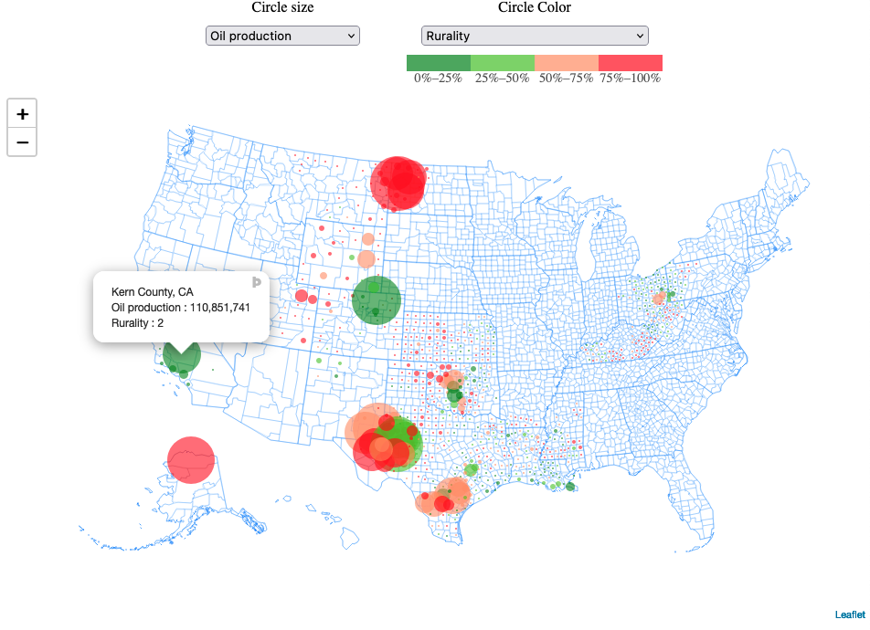

# energy_communities_usmap_Leaflet
 A Leaflet partial replica of the mapbox "Mapping US Energy Communities" from https://www.rff.org/publications/data-tools/mapping-vulnerable-communities/
 
This map is part of a series of replicas of partial replica using different languages and libraries. See https://github.com/vanderlindenma/energy-communities-usmap for a plotly/shiny replica.

Beyond this particular application, the app could serve as a useful template
for open source interactive maps of U.S. counties using Leaflet.

{:target="_blank"}

There are a number of features I did not take the time to replicate from the original. These include:

- Circle-color-specific scales and legends,
- Tooltip formatting (including adding units),
- Full list of variables in selectors,
- ...

I've also done most of the data-wrangling in `counties_merge.R` to generate `merged_counties.geojson` (sorry for harcore `js` fans but I still think `2^(16:7)` is faster to write, more readable, an less prone to errors than `Array.from(new Array(10), (x, i) => 16-i).map((d) => Math.pow(2,d))`). 
In particular, `merged_counties.geojson` contains all combinations of layers (size x color).
Also note that once new clean data is generated through `counties_merge.R`, there remains a manual copy-paste step I haven't automated to bring the content of `merged_counties.geojson` into `counties_data.js` as a `var` (see https://stackoverflow.com/questions/14484613/load-local-json-file-into-variable)

Some things I like better about this implementation compared to the Plotly one:

- Zoom fluidity.
- Seamless circle-color and circle-size changes (unlike my Shiny/Plotly implementation, this implementation does not rebuild the whole graph each time the user changes inputs, it just switches from one layer to the other, which is much faster).

Some things I like better about my Plotly implementation:

- Ability to use the legend to select subsets of the data to be displayed (especially useful given the clutterness of the map for some input selections).

